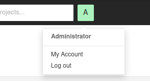
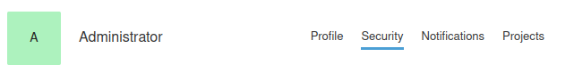

Installation documentation
==========================

Requirements
------------

- Docker
- Docker-compose

Project structure
-----------------

Here is a preview of project tree :

```txt
Ecocode              # Root directory
|
+--java-plugin       # JAVA
|
+--php-plugin        # PHP
|
+--python-plugin     # Python
|
\--docker-compose.yml   # Docker compose file
```

You will find more information about the plugins’ architecture in their folders

Howto build the SonarQube ecoCode plugins
-----------------------------------------

### Requirements

- Java >= 11.0.17
- Mvn 3
- SonarQube 9.4 to 9.8

### Build the code

You can build the project code by running the following command in the `src` directory.
Maven will download the required dependencies.

```sh
./tool_build.sh
```

Each plugin is generated in its own `<plugin>/target` directory, but they are also copied to the `lib` directory.

Howto install SonarQube dev environment
---------------------------------------

### Requirements

You must have built the plugins (see the steps above).

### Start SonarQube (if first time)

Run the SonarQube + PostgreSQL stack:

```sh
./tool_docker-init.sh
```

Check if the containers are up:

```sh
docker ps
```

You should see two lines (one for sonarqube and one for postgres).
If there is only postgres, check the logs:

```sh
./tool_docker-logs.sh
```

If you have this error on run:
`web_1 | [1]: max virtual memory areas vm.max_map_count [65530] is too low, increase to at least [262144]`
you can allocate more virtual memory:

```sh
sudo sysctl -w vm.max_map_count=262144
```

For Windows:

```sh
wsl -d docker-desktop
sysctl -w vm.max_map_count=262144
```

Go to http://localhost:9000 and use these credentials:

```txt
login: admin
password: admin
```

When you are connected, generate a new token:

`My Account -> Security -> Generate Tokens`




Start again your services using the token:

```sh
TOKEN=MY_TOKEN docker-compose up --build -d
```

### Reinstall SonarQube (if needed)

```sh
# first clean all containers and resources used
./tool_docker-clean.sh

# then, install from scratch de SonarQube containers and resources
./tool_docker-init.sh
```

Howto install Plugin Ecocode
----------------------------

Install dependencies from the root directory:

```sh
./tool_build.sh
```

Result : JAR files (one per plugin) will be copied in `lib` repository after build.

Howto start or stop service (already installed)
-----------------------------------------------

Once you did the installation a first time (and then you did custom configuration like quality gates, quality
profiles, ...),
if you only want to start (or stop properly) existing services :

```sh
./tool_start.sh
./tool_stop.sh
```

Howto create a release
----------------------

1. add release notes in `CHANGELOG.md` file for next release
    1. create a new section with title like `Release X.Y.Z`
        1. ... where `X.Y.Z`is the new release
        2. respect [Keep a Changelog](https://keepachangelog.com/en/1.0.0/) format
    2. give empty `Unreleased` section
        1. in majority cases, old content of `Unreleased` section is now the content of the new `Release X.Y.Z` section
    3. add a new section at the bottom of file with new version
    4. commit these modifications
2. if all is ok, execute `tool_release_1_prepare.sh` to prepare locally the next release and next SNAPSHOT (creation of
   2 new commits and a tag)
3. if all is ok, execute `tool_release_2_branch.sh` to create and push a new branch with that release and SNAPSHOT
4. if all is ok, on github, create a PR based on this new branch to `main` branch
5. wait that automatic check on the new branch are OK, then check modifications and finally merge it
6. if PR merge is OK, then delete the branch as mentionned when PR merged
7. wait that automatic check on the `main` branch are OK, and then if all is ok, upgrade your local source code from
   remote, and go to `main` branch and finally check locally if the
   new tag is already present on commit starting like `[maven-release-plugin] prepare release ...`. The tag
   name is the version present in that commit message. The format is `X.Y.Z` (ex : 1.2.3)
    1. create the new tag locally if not present on that commit
8. push new tag with `git push --tags`
9. an automatic workflow started on github and create the new release of plugin

Howto debug a rule (with logs)
------------------------------

1. Add logs like in `java-plugin/src/main/java/fr/cnumr/java/checks/OptimizeReadFileExceptions` class file
2. Build plugin JARs with `tool_build.sh`
3. Launch local Sonar with `tool_docker_init.sh`
4. Launch a sonar scanner on an exemple project with `mvn verify` command (only the first time), followed by `mvn org.sonarsource.scanner.maven:sonar-maven-plugin:3.9.1.2184:sonar -Dsonar.login=***** -Dsonar.password=***** -X`
5. logs will appear in console (debug logs will appear if `-X` option is given like above)

Links
-----

- Java how-to : https://github.com/SonarSource/sonar-java/blob/master/docs/CUSTOM_RULES_101.md
- Python how-to : https://github.com/SonarSource/sonar-custom-rules-examples/tree/master/python-custom-rules
- PHP how-to : https://github.com/SonarSource/sonar-custom-rules-examples/tree/master/php-custom-rules
