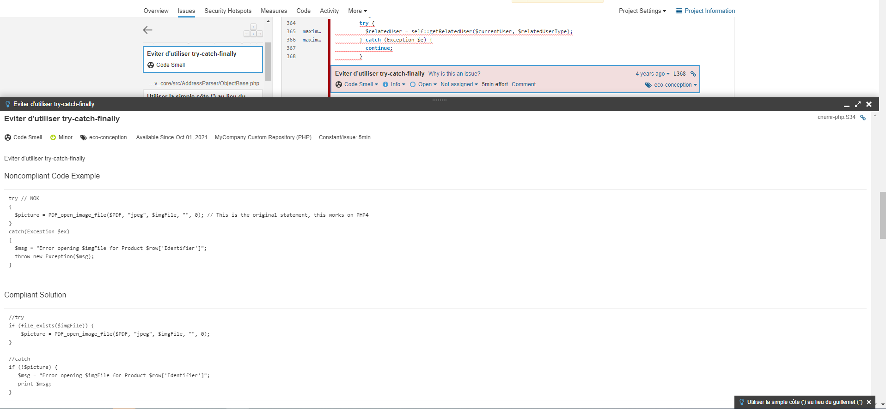

======================================

*ecoCode* is a collective project aiming to reduce environmental footprint of software at the code level. The goal of the project is to provide a list of static code analyzers to highlight code structures that may have a negative ecological impact: energy and resources over-consumption, "fatware", shortening terminals' lifespan, etc.

ecoCode is based on evolving catalogs of [good practices](docs/rules), for various technologies. A SonarQube plugin then implement these catalogs as rules for scanning your projects.

**Warning**: this is still a very early stage project. Any feedback or contribution will be highly appreciated. Please refer to the contribution section.

🌿 SonarQube Plugin
-------------------

5 technologies are supported by the plugin right now:

- [Java](java-plugin/)
- [PHP](php-plugin/)
- [Python](python-plugin/)

### eco-design SonarQube plugin

There is two kind of plugins :

- One for web / backoffice (PHP, Python, Java), using smells described in the 2nd edition of the repository published in september 2015
You can find all the rules [here (in french)](https://docs.google.com/spreadsheets/d/1nujR4EnajnR0NSXjvBW3GytOopDyTfvl3eTk2XGLh5Y/edit#gid=1386834576)
The current repository is for web / backOffice
- One for mobile (Android), using [a set of smells](https://olegoaer.perso.univ-pau.fr/android-energy-smells/) theorised by Olivier Le Goaër for Android.
You can find this plugin in the repository [here](https://github.com/green-code-initiative/ecocode-mobile)

### How a SonarQube plugin works

Code is parsed to be transformed as AST. AST will allow you to access one or more nodes of your code.
For example, you’ll be able to access of all your `for` loop, to explore content etc.

To better understand AST structure, y a can use [AST Explorer](https://astexplorer.net/)

🚀 Getting Started
------------------

You can download each plugin separatly or you can directly use a [all-in-one docker-compose](INSTALL.md)

🤝 Contribution
---------------

You are a technical expert, a designer, a project manager, a CSR expert, an ecodesign expert...

You want to offer the help of your company, help us to organize, communicate on the project?

You have ideas to submit to us?

We are listening to you to make the project progress collectively, and maybe with you!

WE NEED YOU !

Here the [starter-pack](https://github.com/green-code-initiative/ecoCode-challenge/blob/main/starter-pack.md)

🤓 Main contributors
--------------------

Any question ? We are here for you !
first, create an issue, please.
Then, if no answer, contact ...

- Jules Delecour
- [Geoffrey Lalloué](https://github.com/glalloue)
- Julien Hertout
- [Justin Berque](https://www.linkedin.com/in/justin-berque-444412140)
- [Olivier Le Goaër](https://olegoaer.perso.univ-pau.fr)
- Maxime DUBOIS
- [David DE CARVALHO](https://www.linkedin.com/in/%E2%80%8E-%E2%80%8E-%E2%80%8E-%E2%80%8E-%E2%80%8E-david%E2%80%8E-%E2%80%8E-%E2%80%8E-%E2%80%8E-%E2%80%8E-%E2%80%8E-%E2%80%8E%E2%80%8E-%E2%80%8E-%E2%80%8E-%E2%80%8E-de-carvalho%E2%80%8E-%E2%80%8E-%E2%80%8E-%E2%80%8E-%E2%80%8E-8b395284/)

🧐 Core Team Emeriti
--------------------

Here we honor some no-longer-active core team members who have made valuable contributions in the past.

- Gaël Pellevoizin
- [Nicolas Daviet](https://github.com/NicolasDaviet)
- [Mathilde Grapin](https://github.com/fkotd)

They have contributed to the success of ecoCode :

- [Davidson Consulting](https://www.davidson.fr/)
- [Orange Business Services](https://www.orange-business.com/)
- [Snapp'](https://www.snapp.fr/)
- [Université de Pau et des Pays de l'Adour (UPPA)](https://www.univ-pau.fr/)

They supported the project :

- [Région Nouvelle-Aquitaine](https://www.nouvelle-aquitaine.fr/)

Links
-----

- https://docs.sonarqube.org/latest/analysis/overview/