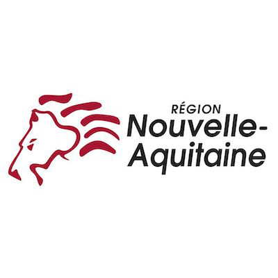
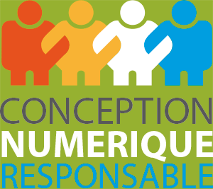

# ecoCode

----
**How green is you app?**

ecoCode is a set of good and bad practices ("smells") for mobile development. Focused today on Android’s Java and XML, we aim to cover all languages used on every mobile platform.
We developed a SonarQube plugin which can help you to avoid mistakes in your apps and help to save energy.

At first based on a [set of smells](https://olegoaer.perso.univ-pau.fr/android-energy-smells/) theorised by Olivier Le Goaër, we are totally open to add more if you have data on others smells !

Here is a list of implemented smells. If you’re developer, feel free to add more, there’s another list needing to be implemented ! (*coming soon*)

----
## To start using ecoCode SonarQube plugin

See our documentation on the [dedicated README](sonarqube-plugin-greenit/README.md) (only in french at this moment. Help up by translating it !) 

## Main contributors
- Gaël Pellevoizin 
- Nicolas Daviet
- Geoffrey Lalloué
- Mathilde Grapin
- Jules Delecour
- Julien Hertout
- [Justin Berque](https://www.linkedin.com/in/justin-berque-444412140)
- [Olivier Le Goaër](https://olegoaer.perso.univ-pau.fr)

## Main sponsors

