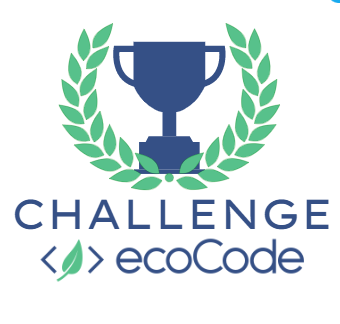

  

<h1 align="center">Welcome to ecoCode Challenge</h1>

💪 Help us improve ecoCode (powered by SonarQube) by contributing to various [work-packages](work-packages.md).

🏁 Start by checking the [coding tips](coding-tips.md) and our [starter pack](starter-pack.md). 

💬 At every moment of the challenge, [start new discussions](https://github.com/cnumr/ecoCode/discussions/new?category=hackathon) or [join existing ones](https://github.com/cnumr/ecoCode/discussions/categories/hackathon).
